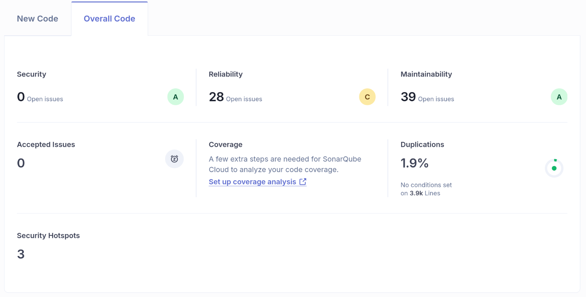
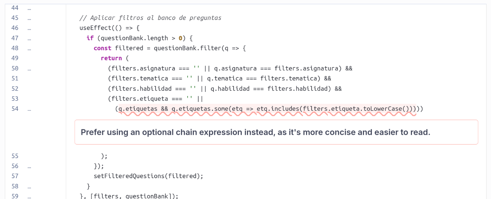
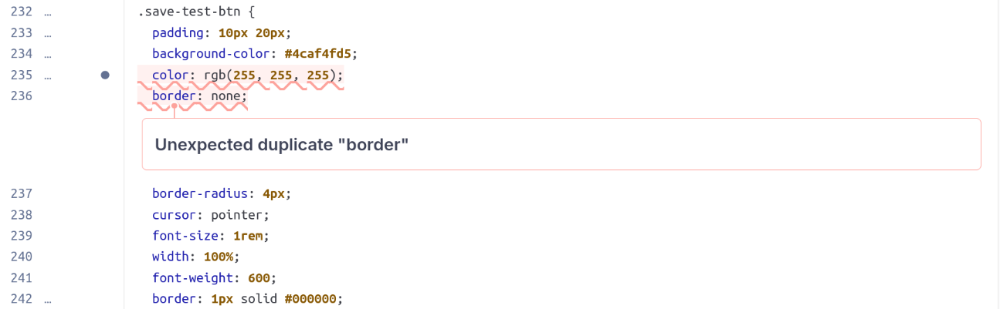

# Inspección 1 (commit [602d271e](https://github.com/grupo15-inf225-2025-2/paes-sip/commit/602d271e1914c7163f88d3d176258f963317c905))

## Total de issues: 62

## Quality issues a tratar:

### - 1) [Verificación de objeto null/undefined](https://sonarcloud.io/project/issues?impactSeverities=MEDIUM&issueStatuses=OPEN%2CCONFIRMED&id=grupo15-inf225-2025-2_paes-sip&open=AZqSVDOtJCSUuzj05NSD&tab=code)

Severidad: Media (Mantenibilidad)

#### Descripción:

Antes de acceder a un atributo de un objeto, tenemos que verificar que el objeto no sea null o undefined. SonarQube nos recomienda ocupar el operador de "optional chaining" que viene con JavaScript, que nos permite acceder a los atributos o métodos de un objeto sin tener que preocuparnos si el objeto es null o undefined.

#### Qué se hará:

Ocupar este operador hace que la lectura del código sea mejor, y nos quita la responsabilidad de hacer la lógica para esta verificación, lo que reduce la probabilidad de errores en nuestro código.
Por lo tanto, vamos a implementar esta recomendación.

### - 2) [Propiedad de CSS duplicada](https://sonarcloud.io/project/issues?impactSeverities=MEDIUM&issueStatuses=OPEN%2CCONFIRMED&id=grupo15-inf225-2025-2_paes-sip&open=AZqSVDORJCSUuzj05NR8&tab=code)

Severidad: Media (Fiabilidad)

#### Descripción:

Se declara el valor de una propiedad (border) de una etiqueta CSS (.save-test-btn) dos veces. El comportamiento de CSS hace que solo la útlima declaración se haga efectiva, lo cual no genera errores pero puede producir confusiones o comportamientos inesperados. Por esto, SonarQube nos recomienda no tener propiedades duplicadas.

#### Qué se hará:

Eliminaremos la primera declaración, lo cual no afectaría al comportamiento actual de la aplicación ya que sólo se evalua la segunda.
