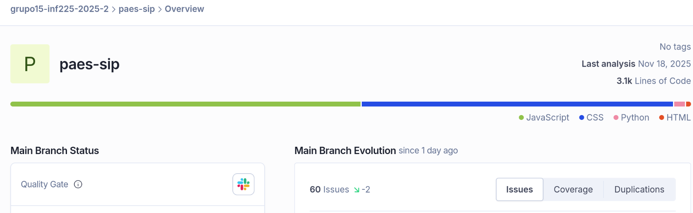
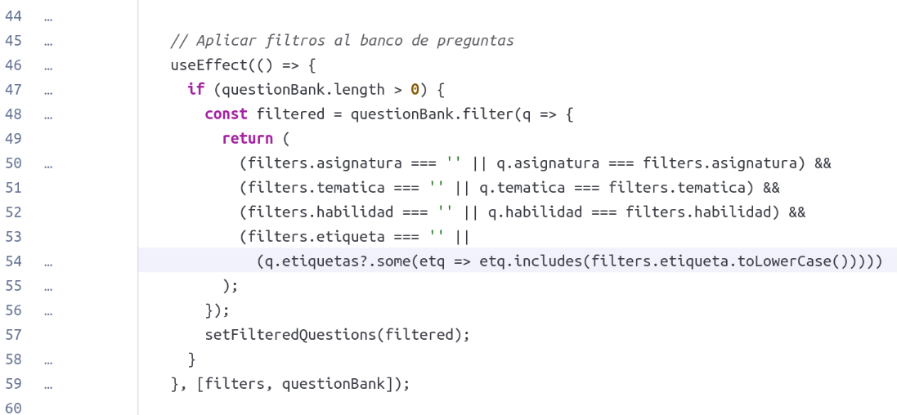
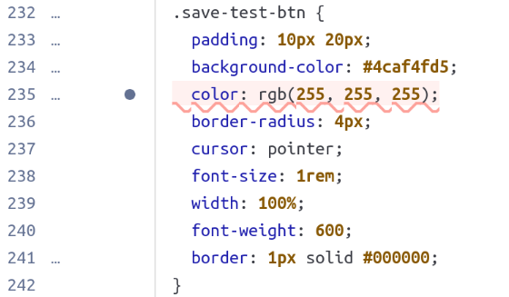

# Inspección 1 (commit [51c788a](https://github.com/grupo15-inf225-2025-2/paes-sip/commit/51c788a6f8b2f8e3abbe90d8b63e59c91671f7ea))

## Total de issues: 60

### Arreglo issue 1:

### Arreglo issue 2:

Podemos ver que los cambios propuestos en la inspección anterior, que fueron implementados en el PR [#9](https://github.com/grupo15-inf225-2025-2/paes-sip/pull/9), resultaron en el arreglo de ambos issues.
